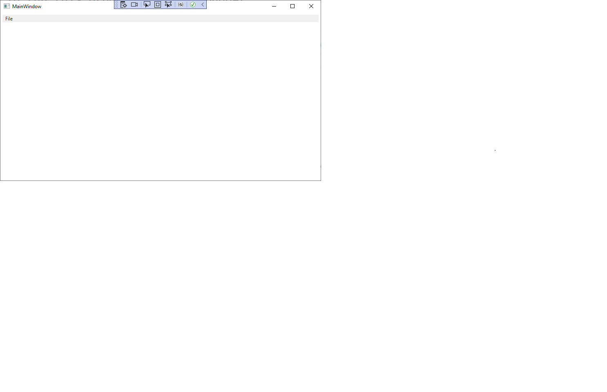
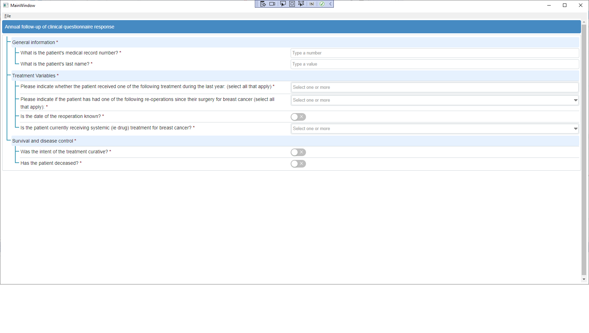

# ICHOMFhirQuestionaireClient
## Purpose
This project implements a windows client to allow viewing and editing of a fhir questionaire resource.

This project was written to be used at the Sep 2022 HL7 Fhir Connectathon, 
and is freely available to anyone who wants to implement a quick and simple windows 
FHIR questionaire client.

This project is a test project, and is not meant to be used "as is" for any medical software production system.

## Implementation

This project is implemented in .net/C# using Microsoft Visual Studio 2022.

This project implements a windows .net executable that when run opens a simple window (xaml) with an embedded
embedded browser (WebView2). This browser loads the included web page (index.html) which includes the 
National Institute of Health LHC-Forms package.

The LHC-Forms package allows viewing and editing of a fhir questionaire resource.
https://lhncbc.github.io/lforms/versions/13.x/index.html

The current ICHOM questionaires are included and can each be loaded, data entered, and the results read back.

## Debugging

To run this program in the debugger, 
1. Download Visual Studio 2022.
2. Download the ICHOMFhirQuestionaireClient code
3. Start visual studio and load the ICHOMFhirQuestionaireClient solution.
4. Compile
5. Debug the ICHOMFhirQuestionaireClient project.

## Install Executable
This is still being worked on.

## Executon
When you start the program, you will see a screen like the following.

To load a questionaire, select File/Load Questionaire menu item and select any of the ICHOM questionaire files.

This will load the questionaire into the window, and you should see something like this.

Here you can enter the data into the form.

To load a questionaire answers, select File/Save Questionaire menu item and select the output file to save
thhe FHIR QuestionaireResponse json resource to.

## Final
This is a work in progress, and is not meant to be a fully functioning system.

